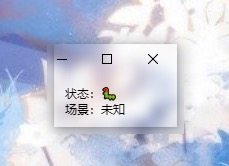

# obsScene

## 功能

显示当前OBS的场景名称, 方便查看自动切换场景是否生效

1. 快速双击关闭应用
2. 拖拽移动位置

## 技术栈

基于obs自带的websocket通信, 使用`wails`嵌入html页面

## obs设置

`工具 --> WebSocket 服务器设置 --> 开启 --> 端口设置4444 --> 关闭密码`

只支持本机的`127.0.0.1:4444`且无密码

## 图片

macos: 

windows:

