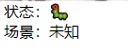
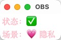

# obsScene

[README_EN](README_EN.md)

## 功能

显示当前OBS的场景名称, 方便查看自动切换场景是否生效

1. 快速双击关闭应用
2. 拖拽移动位置

## 技术栈

基于obs自带的websocket通信, 使用`neutralino`嵌入html页面

感谢 `neutralino`的`build-scripts`项目

## 移植

`/resources/index.html`和 `/resources/js/obs-websocket-js.js`

可以使用自己喜欢的webview平台嵌入, 需要删掉和`neutralino`相关的部分

用tauri 打包了一个macos\_x86版本

## obs设置

`工具 --> WebSocket 服务器设置 --> 开启 --> 端口设置4444 --> 关闭密码`

地址写死是因为`neutralino`不会记住`localstorage`

所以只支持本机的`127.0.0.1:4444`且无密码

## 图片

macos(支持半透明特性): 

windows(不支持半透明, 需要额外安装===edge webview2===):

macos + tauri : 

