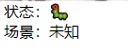

# obsScene

## Features

Displays the current OBS scene name, making it easy to check if automatic scene switching is working.

1. Double-click quickly to close the application.
2. Drag to move the window.

## Technology Stack

Uses OBS's built-in WebSocket communication and embeds an HTML page using `neutralino`.

Thanks to the build-scripts project from neutralino.

## Portability

`/resources/index.html` and `/resources/js/obs-websocket-js.js`

You can embed these using your preferred webview platform. Just remove the parts related to `neutralino`.

A macOS\_x86 version has been packaged using Tauri.

## OBS Settings

`Tools --> WebSocket Server Settings --> Enable --> Set Port to 4444 --> Disable Password`

The address is hardcoded because `neutralino` doesn't retain `localStorage`.

Therefore, it only supports the local `127.0.0.1:4444` without a password.

## Images

macOS (supports transparency):

Windows (does not support transparency, requires additional installation of Edge Webview2):

macOS + Tauri:
